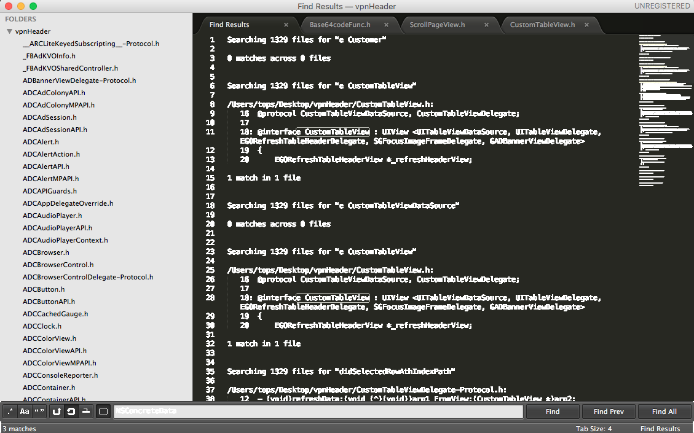

# 绕过广告的APP
本案列主要讲述如果在使用APP时候通过hook可执行文件，通过辅助工具分析，还原高级代码，并修改其代码实现逻辑，达到去除广告的效果

### 目标APP ovpn搜索
此APP在国内无法下载，所以只能通过在美国账号，下载其APP，然后用越狱手机进行砸壳等程序，在使用ida工具和class-dump,符号还原表工具restore-symbol

### 具体操作步骤
###### 砸壳
使用 Clutch 对越狱手机上应用进行砸壳

###### 准备工作
 一台越狱的手机，一台MAC
######  操作步骤
下载Clutch:
1. 已编译版本： https://github.com/KJCracks/Clutch/releases
未编译可用代码
```
$ git clone https://github.com/KJCracks/Clutch
    $ cd Clutch
    $ xcodebuild -project Clutch.xcodeproj -configuration Release ARCHS="armv7 armv7s arm64" build #使用Xcode编译
````
2. 将工具拷贝到手机：/usr/bin/  路径下
工具：iFunBox 或者其他的第三方工具
命令：

```
 scp Clutch/clutch root@<你设备IP>:/usr/bin/
```

3. 确保手机已经连接了WIFI并且你的手机的WIFI和你的电脑要在同一个局域网内,打开终端输入:

```
ssh mailto:root@xx.xx.xx.xx,(xx.xx.xx.xx)为你的手机的IP地址-->Enter
```

4. 接着会提示你输入password:这里的密码一般情况下是alpine,但是如果你更改过的话就用你更改的这里的密码是手机openssh的密码,不是电脑密码也不是手机解锁密码
5. 打开目录
   
```
cd /usr/bin
```

6. 截止到上一步，Clutch已经安装成功了，下面就可以开始砸壳了，输入:

```
Clutch -i
```


```
获取已安装应用的包名，显示如下：
bash
                #Installed apps:
                #1:WeChat <com.tencent.xin>
                #2:DingTalk <com.laiwang.DingTalk>
这里只截取了一部分
```

7. 有了包名就可以执行砸壳了，这里以微信为例子，输入以下命令

```
$ clutch -d com.tencent.xin
```
显示如下

```
 # com.tencent.xin contains watchOS 2 compatible application. It's not possible to dump watchOS 2 apps with Clutch 2.0.4 at this moment.
# Zipping WeChat.app
# Swapping architectures..
# ASLR slide: 0xb3000
# ...
# writing new checksum
#DONE:/private/var/mobile/Documents/Dumped/com.tencent.xin-iOS7.0-(Clutch-2.0.4).ipa
# Finished dumping com.tencent.xin in 76.9 seconds
```
拿到被砸壳的app,使用scp命令拷贝到Mac电脑中

```
scp /private/var/mobile/Documents/Dumped/com.tencent.xin-iOS7.0-(Clutch-2.0.4).ipa root@xx.xx.xx.xx,(xx.xx.xx.xx)为你的手机的IP地址:拷贝目录（/Users/tops/Desktop/ios）
```

### 安装class-dump
下载地址：http://stevenygard.com/projects/class-dump/。 打开链接后，选择[class-dump-3.5.dmg](http://stevenygard.com/download/class-dump-3.5.dmg)，进行下载。下载完成之后，将dmg文件中的class-dump复制到/usr/bin目录，并在终端执行如下执行进行赋权：

```
sudo chmod 777 /usr/bin/class-dump
```

执行命令导出头文件

```
class-dump -H Ovpn.app/ -o /Users/tops/Desktop/vpnHeader
```
如图所示


    
### 使用monkey APP安装被砸壳的应用到手机
[具体教程](https://github.com/AloneMonkey/MonkeyDev/wiki)
### 安装ida
具体地址


### 分析

```
void __cdecl -[ScrollPageView didSelectedRowAthIndexPath:IndexPath:FromView:](ScrollPageView *self, SEL a2, id a3, id a4, id a5)
{
  id v5; // x19
  id v6; // x20
  ScrollPageView *v7; // x21
  void *v8; // x22
  void *v9; // x0
  void *v10; // x0
  void *v11; // x22
  void *v12; // x0
  struct objc_object *v13; // x23
  void *v14; // x0
  void *v15; // x24
  void *v16; // x26
  void *v17; // x27
  void *v18; // x0
  void *v19; // x25
  void *v20; // x22
  void *v21; // x23
  signed __int64 v22; // ST00_8
  _BOOL8 v23; // ST08_8
  signed __int64 v24; // x8
  __int64 v25; // x25
  const char *v26; // x1

  v5 = a4;
  v6 = a3;
  v7 = self;
  v8 = objc_msgSend(a5, "tableInfoArray");
  v9 = objc_msgSend(v5, "row");
  v10 = objc_msgSend(v8, "objectAtIndex:", v9);
  v11 = v10;
  v12 = objc_msgSend(v10, "objectForKey:", CFSTR("openvpn_configdata"));
  v13 = +[Base64codeFunc dataWithBase64EncodedString:](
          &OBJC_CLASS___Base64codeFunc,
          "dataWithBase64EncodedString:",
          v12);
  v14 = (void *)NSSearchPathForDirectoriesInDomains(13LL, 1LL, 1LL);
  v15 = objc_msgSend(v14, "objectAtIndex:", 0LL);
  v16 = objc_msgSend(&OBJC_CLASS___NSString, "alloc");
  v17 = objc_msgSend(v11, "objectForKey:", CFSTR("countryshort"));
  v18 = objc_msgSend(v11, "objectForKey:", CFSTR("hostname"));
  v19 = objc_msgSend(v16, "initWithFormat:", CFSTR("%@_%@.ovpn"), v17, v18);
  v20 = objc_msgSend(v15, "stringByAppendingPathComponent:", v19);
  objc_msgSend(v13, "writeToFile:atomically:", v20, 0LL);
  objc_msgSend(v19, "release");
  if ( !((unsigned __int64)-[ScrollPageView isNotSubcription](v7, "isNotSubcription") & 1) )
  {
    v26 = "popupView:IndexPath:FilePath:";
    goto LABEL_5;
  }
  v21 = objc_msgSend(&OBJC_CLASS___NSUserDefaults, "standardUserDefaults");
  v22 = v7->gadcnt;
  v23 = v7->badInter;
  NSLog(CFSTR("gadcnt: %ld , badInter: %d"));
  v7->aaIndexPath = (NSIndexPath *)v5;
  v7->aaTableView = (UITableView *)v6;
  objc_msgSend(v21, "setObject:forKey:", v20, CFSTR("realPath"));
  v24 = v7->gadcnt;
  v25 = v24
      - 3
      * (((unsigned __int128)(v24 * (signed __int128)6148914691236517206LL) >> 64)
       + ((unsigned __int64)((unsigned __int128)(v24 * (signed __int128)6148914691236517206LL) >> 64) >> 63));
  v7->gadcnt = v24 + 1;
  objc_msgSend(v21, "setInteger:forKey:");
  if ( v25 )
  {
    v26 = "popuppView:IndexPath:FilePath:";
LABEL_5:
    objc_msgSend(v7, v26, v6, v5, v20);
    return;
  }
  if ( !((unsigned __int64)-[ScrollPageView showInterstitial](v7, "showInterstitial") & 1) )
    -[ScrollPageView popuppView:IndexPath:FilePath:](v7, "popuppView:IndexPath:FilePath:", v6, v5, v20);
  NSLog(CFSTR("aiaiai"));
}
```

被还原后的高级代码，并修改相关移除广告逻辑

```
%hook ScrollPageView

- (void)didSelectedRowAthIndexPath:(CustomTableView *)tableView IndexPath:(NSIndexPath *)indexPath FromView:(CustomTableView *)aview {
    //%orig;

    NSDictionary *dic = [aview.tableInfoArray objectAtIndex:indexPath.row];
    //[self popuppView:tableView IndexPath:indexPath FilePath:nil];
    NSString *vpn = [NSString stringWithFormat:@"%@_%@.ovpn", [dic objectForKey:@"countryshort"], [dic objectForKey:@"hostname"]];
    NSString *path = [NSSearchPathForDirectoriesInDomains(NSCachesDirectory, NSApplicationDirectory, YES) firstObject];//[NSSearchPathForDirectoriesInDomains(13, 1, 1) firstObject];
    //NSString *conf
    id data = [%c(Base64codeFunc) dataWithBase64EncodedString:[dic objectForKey:@"openvpn_configdata"]];
    NSString *endStr = [path stringByAppendingString:vpn];
    [data writeToFile:endStr atomically:NO];
    [self popuppView:tableView IndexPath:indexPath FilePath:endStr];

    NSLog(@"--------------%@", endStr);


}

%end
```


